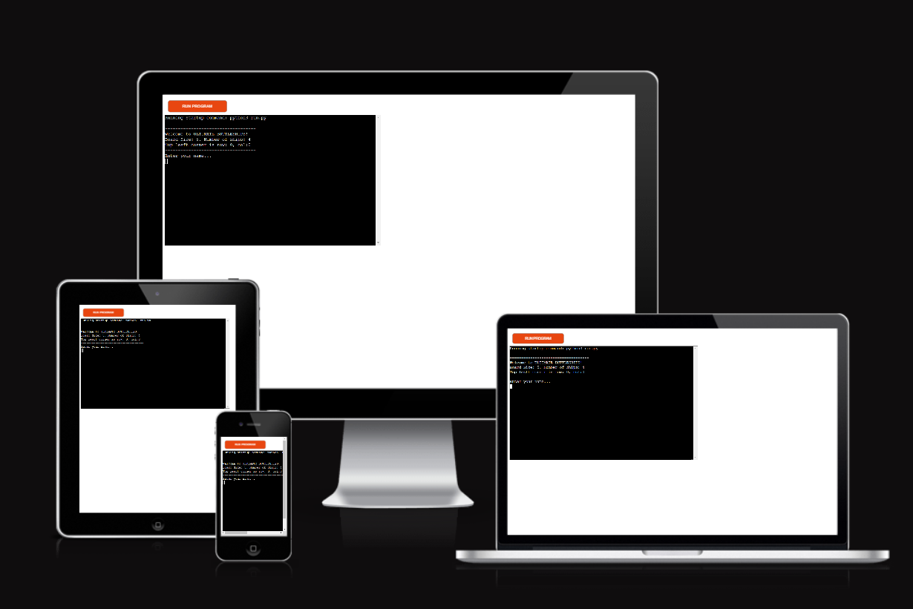

# Battlerships game

---

Ultimate Battlership is a Python terminal game, which runs in the Code Institute mock terminal on Heroku.

Users can try to beat the computer by finding all of the computer's battlerships before the computerfinds their. 

Each battlership occupies one square on the board.
The game starts after the player writes his name.
 

Here [Link](https://buttleerships-game-41ca3ea47dae.herokuapp.com/) you can open live version of the game.
Enjoy it!

## How to play

---

You don't know what a game is?
Find out the basic information on [Wikipedia](<https://en.wikipedia.org/wiki/Battleship_(game)>) as soon as possible. 
Now you're ready to play!

First, the player needs to enter a name, which will then be displayed to show scores. 

After that, a board with a random arrangement of 4 ships will appear. But the location of the ships of the computer is hidden (yes, yes, because this is the point of the game). 

Then the player will be asked to guess the location of the enemy ship using the coordinates of the board. The guess will be marked with an X.
Hits are indicated \*. 

A random number is generated for the computer to guess.
After each round, a scoreboard will appear with the results.  

The winner is the one who managed to sink the enemy ship.

## Featers

---

### _Existing featers:_

- #### Random board generation;

- #### The player cannot see the location of the computer's ships;

- #### The player sees the location of his ships, which are marked with the @ sign.

- #### Hints about the data entry format are displayed before the user makes their choice.

  

- #### Input validation;

  - #### You cannot enter empty string instead of name;

    

  - #### You cannot enter coordinates outside the size of the grid;

    

  - #### You must enter numbers;

    

  - #### Checking the numbers that have already been entered and displaying a message;
    

### _Future featers:_

- #### For better orientation, display the horizontal with numbers and the vertical with letters;

## Testing:

---

- passed the code through PEP8 and confirmed there are no problems
  

- given invalid input
- testing in the terminal after deployment as well

## Bugs:

---

#### _Solved bugs:_

- During testing, I noticed that sometimes when starting the game, not 4 locations are determined, but 3. So I added while True to continue determining the coordinates when the numbers are repeated

- There was an error in the try valid_coordinates part, namely, determining the length of strings. Therefore, before checking, I made the input value an integer.

- When testing the function that checks whether the user has not entered anything when prompted for a name, I noticed that there was still an option to send an empty space. Adding <code>strip()</code> to user entered input solved the issue

#### _Remaining bugs:_

- no remaining bugs

## Deployment:

This project was deployed using Code Institute's mock terminal for Heroku. 

1. Fork or clone the repository
2. Create a new Heroku app
3. Set the buildbacks to <code> Python</code> and <code>Node.js</code> in that order
4. Link the Heroku app to the repository
5. Click on Deploy

---

## Credits:

---

Code Institute's for the deployment terminal; 

Code Institute's Readme example file for inspiration; 

Wikipedia for basic information about the game and for a picture of an example board 

[PythonChecker](https://www.pythonchecker.com/) to check the validation of the Python code

[Mockup screenshot](https://ui.dev/amiresponsive) site image on different devices
